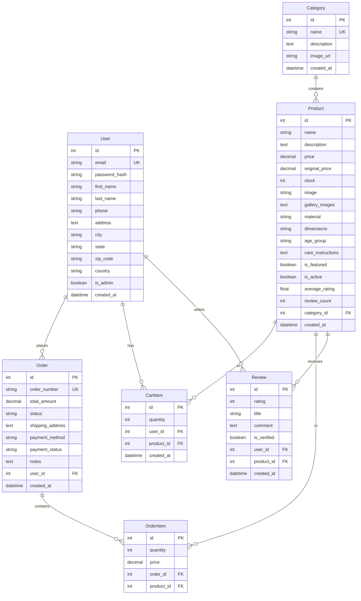

# 🪵 WoodNook - E-commerce Platform for Handcrafted Wooden Products

[](https://opensource.org/licenses/MIT)
[](https://www.python.org/downloads/)
[](https://flask.palletsprojects.com/)
[](https://getbootstrap.com/)

A comprehensive e-commerce platform for selling handcrafted wooden toys, home décor, and artisanal products. Built with Flask, featuring a complete admin panel, user authentication, shopping cart, order management, and Indian payment integration.

## 🌟 Features

### 🛒 **Customer Features**
- **Product Catalog**: Browse products with filtering, sorting, and search functionality
- **Product Details**: Detailed product pages with image galleries, reviews, and specifications
- **Shopping Cart**: Add to cart, update quantities, apply discounts
- **User Authentication**: Registration, login, profile management
- **Order Management**: Place orders, track status, view order history
- **Indian Context**: INR currency, Indian states, PIN codes, GST integration
- **Demo Payment**: Simulated payment processing for testing
- **Responsive Design**: Mobile-first responsive interface

### 👨‍💼 **Admin Features**
- **Dashboard**: Sales analytics, order statistics, recent activity
- **Product Management**: Add, edit, delete products with image upload
- **Category Management**: Organize products into categories
- **Order Management**: View, update order status, process orders
- **User Management**: View customer information and order history

### 🔧 **Technical Features**
- **Database**: SQLite with SQLAlchemy ORM
- **Authentication**: Flask-Login with session management
- **File Upload**: Product image handling with Pillow
- **Form Handling**: Flask-WTF with CSRF protection
- **Error Handling**: Custom 404/500 pages with proper logging
- **Accessibility**: ARIA labels, semantic HTML, keyboard navigation
- **SEO**: Meta tags, structured data, sitemap

## 🏗️ System Architecture

```
┌─────────────────────────────────────────────────────────────┐
│                    WoodNook E-commerce Platform             │
├─────────────────────────────────────────────────────────────┤
│  Frontend (Templates + Bootstrap + JavaScript)             │
│  ┌─────────────┐ ┌─────────────┐ ┌─────────────┐          │
│  │   Customer  │ │    Admin    │ │   Product   │          │
│  │  Interface  │ │   Panel     │ │   Catalog   │          │
│  └─────────────┘ └─────────────┘ └─────────────┘          │
├─────────────────────────────────────────────────────────────┤
│  Backend (Flask Application)                               │
│  ┌─────────────┐ ┌─────────────┐ ┌─────────────┐          │
│  │   Routes    │ │    Auth     │ │   Business  │          │
│  │  & Views    │ │   System    │ │    Logic    │          │
│  └─────────────┘ └─────────────┘ └─────────────┘          │
├─────────────────────────────────────────────────────────────┤
│  Data Layer (SQLAlchemy + SQLite)                          │
│  ┌─────────────┐ ┌─────────────┐ ┌─────────────┐          │
│  │    User     │ │   Product   │ │    Order    │          │
│  │   Models    │ │   Models    │ │   Models    │          │
│  └─────────────┘ └─────────────┘ └─────────────┘          │
└─────────────────────────────────────────────────────────────┘
```

## 🗂️ Database Schema



## 🚀 Quick Start Guide

### Prerequisites
- **Python 3.8+** - [Download Python](https://www.python.org/downloads/)
- **Git** - [Download Git](https://git-scm.com/downloads/)
- **pip** - Python package installer (included with Python)

### 🔧 Installation & Setup

#### 1. Clone the Repository
```bash
git clone https://github.com/ivocreates/WoodNook.git
cd WoodNook
```

#### 2. Create Virtual Environment
```bash
# Create virtual environment
python -m venv venv

# Activate virtual environment
# On Windows:
venv\Scripts\activate

# On macOS/Linux:
source venv/bin/activate
```

#### 3. Install Dependencies
```bash
pip install -r requirements.txt
```

#### 4. Initialize Database & Demo Data
```bash
# Initialize database with tables
python init_db.py

# Load demo data (products, categories, users)
python load_demo_data.py
```

#### 5. Start the Application
```bash
# Start Flask development server
python app.py

# Or use the start script
# On Windows:
start.bat

# On macOS/Linux:
./start.sh
```

#### 6. Access the Application
- **🏠 Main Store**: http://localhost:5000
- **👨‍💼 Admin Panel**: http://localhost:5000/admin
- **📊 Dashboard**: http://localhost:5000/admin/dashboard

### 👤 Demo Credentials

#### Admin Account
- **Email**: admin@woodnook.com
- **Password**: admin123

#### Customer Account
- **Email**: customer@woodnook.com
- **Password**: customer123

### 💳 Demo Payment Information
Use these test card details for checkout:
- **Card Number**: 4111 1111 1111 1111
- **Expiry**: Any future date (MM/YY)
- **CVV**: Any 3 digits
- **Name**: Any name

## 📁 Project Structure

```
WoodNook/
├── 📁 static/                  # Static assets
│   ├── 📁 css/
│   │   └── style.css          # Custom styles
│   ├── 📁 js/
│   │   └── main.js            # JavaScript functionality
│   └── 📁 images/             # Product & UI images
│       ├── hero-*.jpg         # Hero section images
│       ├── products/          # Product images
│       └── icons/             # UI icons
│
├── 📁 templates/              # Jinja2 templates
│   ├── 📁 admin/              # Admin panel templates
│   │   ├── dashboard.html     # Admin dashboard
│   │   ├── products.html      # Product management
│   │   ├── orders.html        # Order management
│   │   └── categories.html    # Category management
│   ├── 📁 auth/               # Authentication templates
│   │   ├── login.html         # Login page
│   │   └── register.html      # Registration page
│   ├── base.html              # Base template
│   ├── index.html             # Homepage
│   ├── products.html          # Product catalog
│   ├── product_detail.html    # Product details
│   ├── cart.html              # Shopping cart
│   ├── checkout.html          # Checkout process
│   ├── profile.html           # User profile
│   ├── orders.html            # Order history
│   ├── about.html             # About page
│   ├── contact.html           # Contact page
│   ├── 404.html               # Error pages
│   └── 500.html
│
├── 📄 app.py                  # Flask application & routes
├── 📄 models.py               # Database models
├── 📄 init_db.py              # Database initialization
├── 📄 load_demo_data.py       # Demo data loader
├── 📄 requirements.txt        # Python dependencies
├── 📄 start.bat               # Windows start script
├── 📄 start.sh                # Unix start script
├── 📄 .gitignore              # Git ignore rules
└── 📄 README.md               # This file
```

## 🔧 Technology Stack

### Backend
- **Framework**: Flask 2.3.0
- **Database**: SQLite with SQLAlchemy ORM
- **Authentication**: Flask-Login
- **Forms**: Flask-WTF + WTForms
- **Image Processing**: Pillow (PIL)
- **Password Hashing**: Werkzeug Security

### Frontend
- **CSS Framework**: Bootstrap 5.3.0
- **Icons**: Bootstrap Icons
- **JavaScript**: Vanilla JS + Fetch API
- **Template Engine**: Jinja2

### Development Tools
- **Version Control**: Git
- **Package Management**: pip
- **Virtual Environment**: venv
- **Database Management**: SQLite Browser (recommended)

## 🛠️ API Endpoints

### Customer Endpoints
| Method | Endpoint | Description |
|--------|----------|-------------|
| `GET` | `/` | Homepage with featured products |
| `GET` | `/products` | Product catalog with filters |
| `GET` | `/product/<int:id>` | Product detail page |
| `GET` | `/cart` | Shopping cart |
| `POST` | `/add-to-cart` | Add product to cart |
| `POST` | `/update-cart` | Update cart item quantity |
| `DELETE` | `/remove-from-cart` | Remove item from cart |
| `GET` | `/checkout` | Checkout page |
| `POST` | `/place-order` | Process order |
| `GET` | `/orders` | Order history |
| `GET` | `/order/<int:id>` | Order details |

### Authentication Endpoints
| Method | Endpoint | Description |
|--------|----------|-------------|
| `GET/POST` | `/login` | User login |
| `GET/POST` | `/register` | User registration |
| `GET` | `/logout` | User logout |
| `GET/POST` | `/profile` | User profile management |

### Admin Endpoints
| Method | Endpoint | Description |
|--------|----------|-------------|
| `GET` | `/admin` | Admin dashboard |
| `GET` | `/admin/products` | Product management |
| `GET/POST` | `/admin/products/add` | Add new product |
| `GET/POST` | `/admin/products/edit/<int:id>` | Edit product |
| `DELETE` | `/admin/products/delete/<int:id>` | Delete product |
| `GET` | `/admin/orders` | Order management |
| `POST` | `/admin/orders/update-status` | Update order status |
| `GET` | `/admin/categories` | Category management |

### AJAX Endpoints
| Method | Endpoint | Description |
|--------|----------|-------------|
| `GET` | `/api/cart-count` | Get cart item count |
| `POST` | `/api/add-review` | Add product review |
| `GET` | `/api/product-search` | Search products |

```
WoodNook/
├── app.py                  # Main Flask application
├── init_db.py             # Database initialization script
├── requirements.txt       # Python dependencies
├── config.py              # Configuration settings
├── models.py              # Database models
├── static/                # Static files (CSS, JS, Images)
│   ├── css/
│   ├── js/
│   ├── images/
│   └── uploads/           # Product images
├── templates/             # HTML templates
│   ├── base.html
│   ├── index.html
│   ├── products.html
│   ├── product_detail.html
│   ├── cart.html
│   ├── checkout.html
│   ├── auth/
│   └── admin/
└── demo_data.py          # Demo data population
```

## 🧱 Features

### 👩‍🎨 Frontend Features
- ✅ Home page with aesthetic banner and featured items
- ✅ Products page with category filtering
- ✅ Product detail pages with ratings
- ✅ Shopping cart functionality
- ✅ User authentication (login/signup)
- ✅ Contact and About pages
- ✅ Fully responsive design

### 🛠 Admin Panel
- ✅ Add/edit/delete products
- ✅ View and manage orders
- ✅ Upload product images
- ✅ Manage categories
- ✅ Dashboard analytics

### 💸 E-Commerce Features
- ✅ Cart management
- ✅ Order processing
- ✅ Payment integration (demo)
- ✅ Order history
- ✅ Product reviews

## 🛒 Demo Data

The application comes pre-loaded with:
- 15+ sample products across categories
- Demo user accounts
- Sample orders and reviews
- Admin account for testing

## 💳 Payment Integration

**Demo Payment Credentials:**
- Card Number: 4242424242424242
- Expiry: Any future date (e.g., 12/25)
- CVV: Any 3 digits (e.g., 123)
- Name: Any name

## 🔐 User Accounts

**Demo Customer Account:**
- Email: customer@demo.com
- Password: demo123

**Admin Account:**
- Email: admin@woodnook.com
- Password: admin123

## 🛠 Tech Stack

- **Frontend**: HTML5, CSS3, JavaScript, Bootstrap 5
- **Backend**: Python Flask
- **Database**: SQLite
- **Authentication**: Flask-Login
- **File Upload**: Flask-WTF
- **Styling**: Bootstrap 5 + Custom CSS

## 📱 Mobile Responsive

The application is fully responsive and optimized for:
- Desktop (1200px+)
- Tablet (768px - 1199px)
- Mobile (< 768px)

## 🚀 Deployment

### Local Development
```bash
python app.py
```

### Production Deployment
1. Update `config.py` with production settings
2. Use a production WSGI server like Gunicorn
3. Configure environment variables
4. Use PostgreSQL for production database

## 🔧 Configuration

Edit `config.py` to customize:
- Database settings
- Secret keys
- Upload directories
- Payment gateway settings

## 📊 Database Schema

### Tables:
- **users**: User accounts and authentication
- **categories**: Product categories
- **products**: Product catalog
- **cart_items**: Shopping cart items
- **orders**: Order management
- **order_items**: Order line items
- **reviews**: Product reviews

## 🎯 Future Enhancements

- AI-powered product recommendations
- Advanced search with filters
- Wishlist functionality
- Multi-language support
- Blog section
- Newsletter subscription
- Social media integration

## 🐛 Troubleshooting

### Common Issues:

1. **Database not found**
   ```bash
   python init_db.py
   ```

2. **Missing dependencies**
   ```bash
   pip install -r requirements.txt
   ```

3. **Permission errors on uploads**
   - Check write permissions on `static/uploads/` directory

## ⚙️ Configuration

### Environment Variables
The application supports the following environment variables:

```bash
# Flask Configuration
FLASK_ENV=development          # development/production
FLASK_DEBUG=True              # True/False
SECRET_KEY=your-secret-key    # Flask secret key

# Database Configuration
DATABASE_URL=sqlite:///woodnook.db  # Database URL

# Upload Configuration
UPLOAD_FOLDER=static/images    # Upload directory
MAX_CONTENT_LENGTH=16777216   # Max file size (16MB)
```

### Application Settings
Key settings in `app.py`:

```python
# Security
app.config['SECRET_KEY'] = 'your-secret-key-here'
app.config['WTF_CSRF_ENABLED'] = True

# Database
app.config['SQLALCHEMY_DATABASE_URI'] = 'sqlite:///woodnook.db'
app.config['SQLALCHEMY_TRACK_MODIFICATIONS'] = False

# File Upload
app.config['UPLOAD_FOLDER'] = 'static/images/products'
app.config['MAX_CONTENT_LENGTH'] = 16 * 1024 * 1024  # 16MB
```

## 🚀 Deployment

### Production Deployment with Gunicorn

1. **Install Gunicorn**:
```bash
pip install gunicorn
```

2. **Create Gunicorn Config** (`gunicorn.conf.py`):
```python
bind = "0.0.0.0:8000"
workers = 4
worker_class = "sync"
timeout = 30
max_requests = 1000
preload_app = True
```

3. **Run with Gunicorn**:
```bash
gunicorn --config gunicorn.conf.py app:app
```

### Docker Deployment

1. **Create Dockerfile**:
```dockerfile
FROM python:3.9-slim
WORKDIR /app
COPY requirements.txt .
RUN pip install -r requirements.txt
COPY . .
RUN python init_db.py && python load_demo_data.py
EXPOSE 5000
CMD ["python", "app.py"]
```

2. **Build and Run**:
```bash
docker build -t woodnook .
docker run -p 5000:5000 woodnook
```

## 🔍 Testing & Quality Assurance

### Recent Fixes & Improvements
- ✅ **Fixed User Model Attribute Error**: Resolved `UndefinedError: 'models.User object' has no attribute 'name'`
- ✅ **Navigation Structure**: Fixed list structure issues and accessibility problems
- ✅ **Template Syntax**: Corrected Jinja2 template errors and formatting
- ✅ **Accessibility**: Added ARIA labels, improved semantic HTML, fixed link text
- ✅ **Code Quality**: Moved inline styles to CSS classes, improved maintainability
- ✅ **Indian Context**: Integrated INR currency, Indian states, PIN codes, GST

### Manual Testing Checklist

#### Customer Flow
- [ ] Homepage loads with featured products
- [ ] Product catalog displays with filters and sorting
- [ ] Product detail pages show correct information
- [ ] Add to cart functionality works
- [ ] Shopping cart updates quantities correctly
- [ ] Checkout process completes with Indian states/PIN
- [ ] Demo payment processing works
- [ ] Order confirmation displays
- [ ] User can view order history

#### Admin Flow
- [ ] Admin login works with demo credentials
- [ ] Dashboard shows correct statistics
- [ ] Product management (CRUD operations)
- [ ] Order status updates work
- [ ] Category management functions properly

## 🐛 Troubleshooting

### Common Issues

#### Database Issues
**Problem**: `OperationalError: no such table`
**Solution**: 
```bash
python init_db.py
python load_demo_data.py
```

#### Template Issues
**Problem**: `UndefinedError` in templates
**Solution**: Check model attributes match template usage

#### File Upload Issues
**Problem**: Images not uploading
**Solution**: 
- Check file size (max 16MB)
- Ensure `static/images/products/` directory exists
- Verify file permissions

## 🤝 Contributing

### Development Process
1. Fork the repository
2. Create feature branch: `git checkout -b feature-name`
3. Make changes and test thoroughly
4. Commit with descriptive messages
5. Create pull request

### Code Standards
- Follow PEP 8 for Python code
- Use semantic HTML and accessibility best practices
- Test accessibility with screen readers
- Ensure mobile responsiveness

## 📞 Support & Contact

### Getting Help
- **Documentation**: This README
- **Issues**: [GitHub Issues](https://github.com/ivocreates/WoodNook/issues)
- **Email**: ivopereiraix3@gmail.com

### Reporting Bugs
Include:
1. Operating system and Python version
2. Steps to reproduce
3. Expected vs actual behavior
4. Error messages/logs

---

## 📄 License

This project is licensed under the MIT License - see the LICENSE file for details.

---

**🌟 Built with ❤️ by [ivocreates](https://github.com/ivocreates) for sustainable, handcrafted living 🌟**

**⭐ Star this repo if you found it helpful! ⭐**
